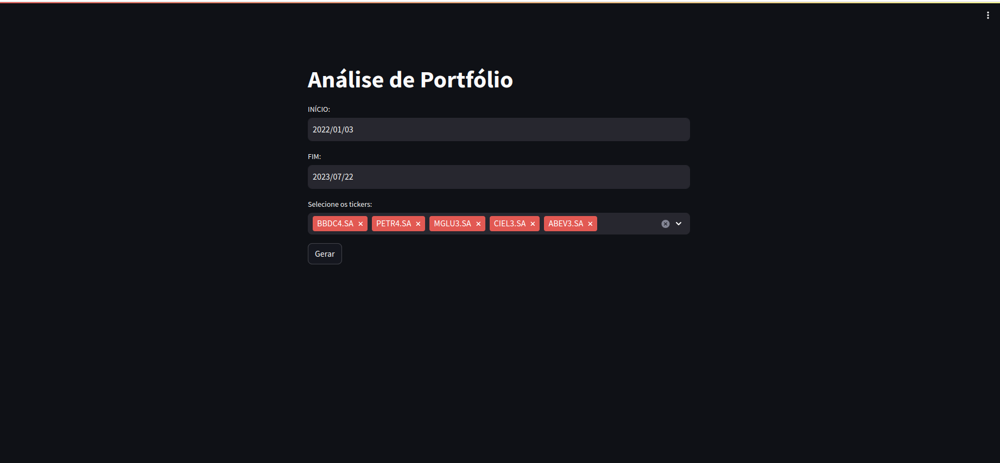
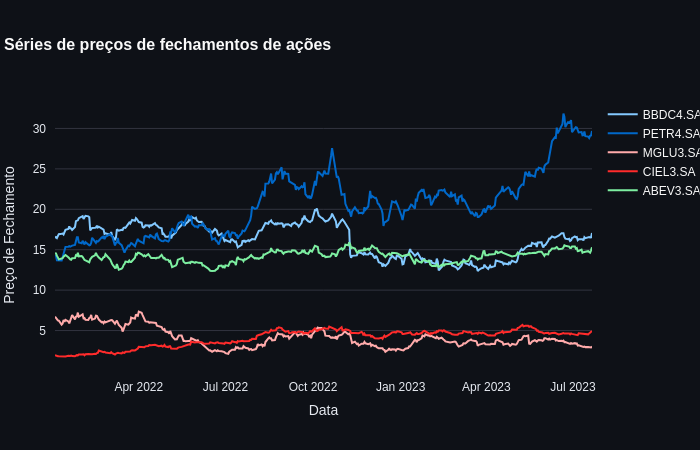
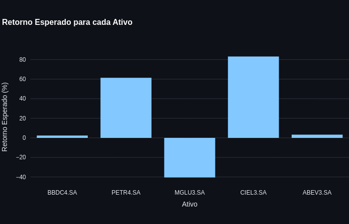
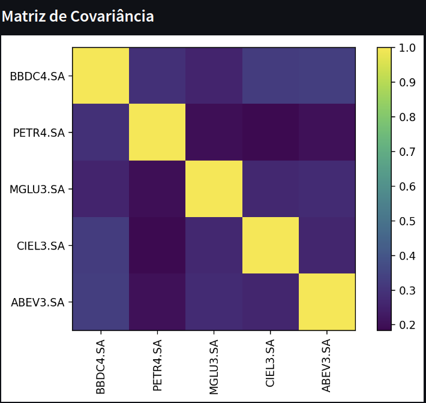
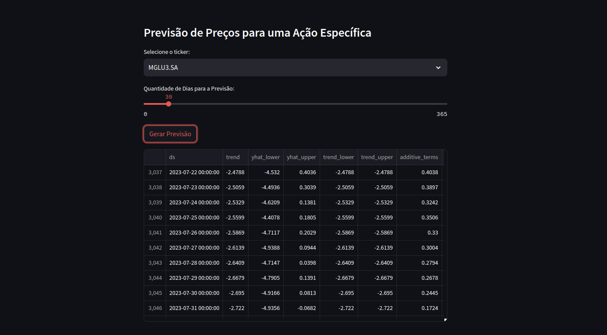
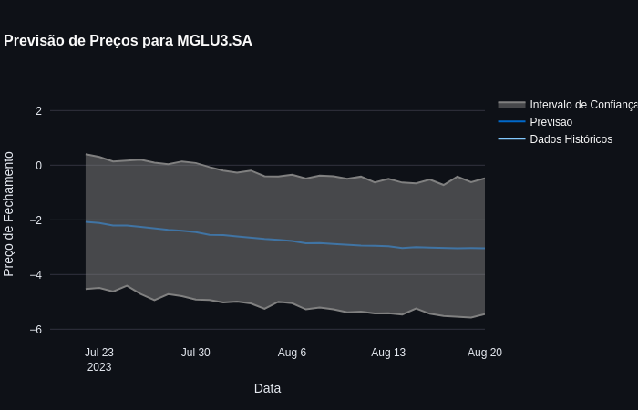

# Efficient Portfolio Analysis Tool using Python and Tkinter GUI



## Table of Contents
- [Introduction](#introduction)
- [Features](#features)
- [Requirements](#requirements)
- [Installation](#installation)
- [Usage](#usage)
- [Demo](#demo)
- [Screenshots](#screenshots)
- [Contributing](#contributing)
- [License](#license)

## Introduction
This repository contains a Python script that allows users to analyze and create efficient portfolios using financial data from the Brazilian stock exchange (B3). The script uses various libraries, including Pandas, NumPy, Matplotlib, Seaborn, YFinance, and pypfopt. The graphical user interface (GUI) is built using Tkinter.

## Features
- **Data Retrieval:** The script fetches historical stock price data from Yahoo Finance using the `yfinance` and `pandas_datareader` libraries for a user-specified date range and a selected list of 40 most frequent tickers on the B3 stock exchange.

- **Efficient Frontier:** The core of the script is an implementation of Modern Portfolio Theory (MPT) to calculate the efficient frontier. It employs the `pypfopt` library to determine the optimal allocation of assets, maximizing the portfolio's Sharpe ratio for a target return.

- **GUI Interface:** The Tkinter-based graphical interface enables users to specify the date range and tickers of interest, view the time series of selected stock prices, visualize the expected returns for each asset, and generate hierarchical cluster dendrograms based on covariance matrix data.

## Requirements
- Python (>=3.6)
- pandas
- numpy
- matplotlib
- seaborn
- yfinance
- pandas_datareader
- pypfopt
- tkinter
- streamlit
- plotly
- ephem
- pystan
- fbprophet

## Installation
1. To install all libraries and run the app:
   ```bash
   chmod +x install_and_run.sh
   ./install_and_run.sh


## Usage
1. Upon running the script, a graphical user interface (GUI) window will open.

2. Specify the desired start and end dates for data retrieval in the GUI. For example:
   - Start Date: `2022-01-01`
   - End Date: the actual date

3. Select the tickers of interest from the provided list of top 40 frequent B3 stocks.


5. To obtain data for the selected tickers:
   - Click the `Obter Dados` (Get Data) button.
   - The application will fetch historical stock price data from Yahoo Finance for the specified date range and tickers.


### Price Series


The price series chart is a fundamental tool for analyzing financial assets such as stocks, bonds, and currencies. It represents the evolution of the closing prices of an asset over time. Each point on the chart represents the closing price of the asset on a specific day, and the line connecting these points shows the trend of price variation.

By analyzing the price series chart, we can identify patterns, trends, and significant movements of the asset. For example, we can observe if the asset is in an uptrend (when prices are consistently rising) or a downtrend (when prices are consistently falling). Additionally, we can identify moments of volatility, i.e., periods when prices have sharp and unpredictable fluctuations.

Another important aspect of the price series chart is the presence of support and resistance levels. Supports are price levels where the asset tends to stop falling and begins to rise again, while resistances are price levels where the asset tends to stop rising and begins to fall again. These levels are crucial for identifying entry and exit points of a trade.

In summary, the price series chart is a valuable tool for understanding the past behavior of an asset and making projections about its future performance. It is one of the main tools used by investors and traders to make informed decisions about their operations.


### Expected Returns


The Expected Returns chart shows the average estimated annual return for each asset selected in the portfolio. The expected return is calculated based on the historical price data of the assets and can help investors understand the growth potential of their investments.

In the chart, each asset is represented by a vertical bar indicating the expected return as a percentage. The higher the bar, the greater the expected return for that asset. This allows investors to identify assets with higher potential returns and can assist them in making informed decisions about their investment allocation.

It is essential to note that expected returns are estimates based on historical data and may not reflect the actual performance of the asset in the future. Other factors, such as economic events, market conditions, and relevant news, can also affect the performance of assets.

Therefore, the Expected Returns chart is a useful tool to assist investors in the analysis and selection of assets for their investment portfolios.


### Covariance Matrix


The Covariance Matrix is an important tool in the analysis of investment portfolios. It represents the covariance relationships between the returns of different assets in the portfolio. In other words, the matrix shows how the returns of each asset move concerning the returns of other assets.

The significance of the Covariance Matrix lies in its ability to measure the degree of dependence or interdependence between assets. When assets have positive covariance, their returns tend to move in the same direction, indicating a higher correlation between them. On the other hand, when assets have negative covariance, their returns tend to move in opposite directions, indicating a lower correlation.

This information is valuable for investors as it helps understand how different assets behave together, which can affect the overall risk and return of the portfolio. A combination of assets with low covariance can reduce portfolio volatility, while a combination of assets with high covariance can increase diversification and protection against specific asset risks.

Additionally, the Covariance Matrix is used to calculate important measures in building efficient portfolios, such as the efficient frontier and asset allocation. The efficient frontier shows the optimal combination of assets that maximizes expected return for a given level of risk, while asset allocation determines the proportion of each asset in the portfolio based on its returns and risks.

In summary, the Covariance Matrix plays a fundamental role in constructing diversified and efficient portfolios, enabling investors to make more informed decisions to achieve their financial objectives.

### Price Forecast
|  |  |

The Price Forecast is a powerful tool for investors and traders who want to project the future behavior of a financial asset, such as a stock or currency. This forecast is based on mathematical and statistical models that analyze the historical price patterns of the asset and seek to identify trends and future movements.

The price forecast can provide valuable insights for investors, helping them make informed decisions about buying or selling assets, as well as the right timing to enter or exit a trade.

Below, we present a step-by-step guide to forming and analyzing price forecasts:

1. **Data Collection**: The first step is to obtain historical price data of the asset you want to forecast. This data can be obtained from sources like Yahoo Finance or financial data APIs.

2. **Data Analysis**: After data collection, it's time to analyze it to identify trends, seasonal patterns, and other relevant behaviors of the asset over time. This can be done through charts, statistical analysis, and other data analysis techniques.

3. **Model Selection**: There are various price forecasting models available, such as ARIMA model, exponential smoothing model, and the Prophet model, among others. The choice of model depends on the available data and specific characteristics of the asset in question.

4. **Model Training**: With the chosen model, it's necessary to train it using historical data. The goal is to adjust the model's parameters so that it can properly capture the patterns present in the data.

5. **Future Forecast**: After training, the model is ready to make predictions for the future. Based on historical data and identified patterns, the model can generate a forecast of the asset's prices for the upcoming days, weeks, or months.

6. **Evaluation and Adjustments**: It's important to evaluate the accuracy of the forecast by comparing it with observed actual prices. If the forecast is not aligned with actual prices, adjustments to the model or approach may be needed.

7. **Decision Making**: With the price forecast in hand and an evaluation of its accuracy, investors can make informed decisions about their trades. This includes deciding when to buy or sell an asset, when to enter or exit a position, and how to manage investment risk.

In summary, the Price Forecast is a valuable tool for investors looking to anticipate market movements and make strategic decisions in their investments.


10. The GUI allows you to update the date range and selected tickers as needed and recalculate the efficient portfolio.

11. Close the GUI window to exit the application.

## Demo
[](https://example.com/path/to/demo_video)


## Contributing
Contributions are welcome! Please fork the repository and create a pull request with your proposed changes.

## License
This project is licensed under the [MIT License](LICENSE).

## Acknowledgements
- The list of top 40 frequent B3 stocks was sourced from a reputable financial data provider.
- The `pypfopt` library was developed by [Jannick Hedegaard](https://github.com/robertmartin8/PyPortfolioOpt) and the contributors.
- Special thanks to the [Alpha Vantage](https://www.alphavantage.co/) team for providing financial market data through their API.

## Contact
For any inquiries or collaboration opportunities, you can reach me via:
- LinkedIn: [linkedin.com/in/eduardofpacheco](https://www.linkedin.com/in/eduardofpacheco)
- Email: [eduardofp@usp.br](mailto:eduardofp@usp.br)